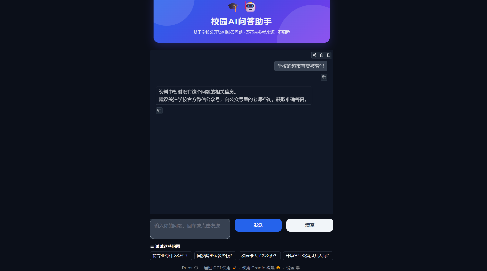
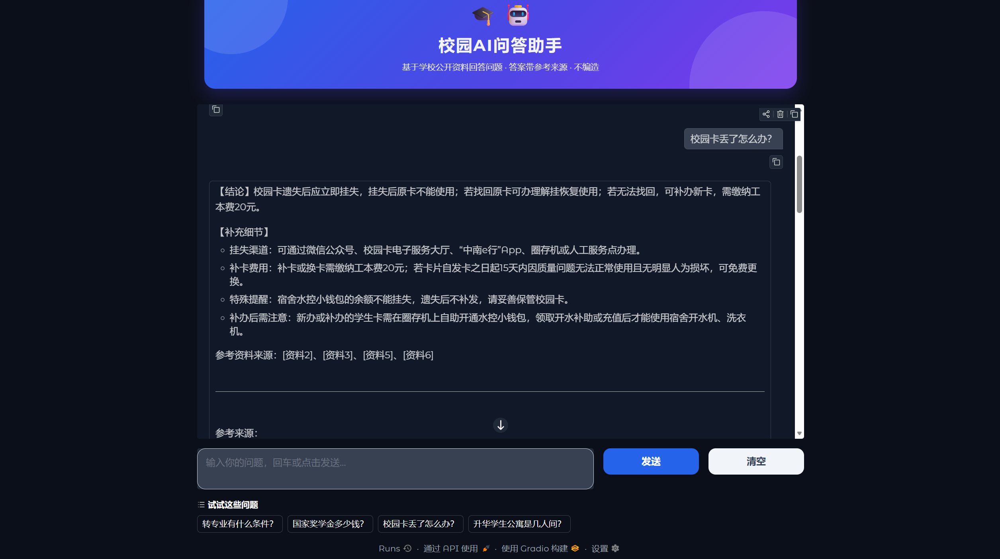

# 校园AI问答助手

基于 **RAG（检索增强生成）** 的校园信息问答系统：把学校公开资料整理成知识库，让大模型只依据资料回答问题，并标注参考来源。

## 功能

- 知识库问答：用自然语言提问，回答基于真实资料、可溯源，不编造
- 中文优化：中文嵌入模型 + DeepSeek 大模型，中文效果好、成本低
- 本地可跑：一条命令启动网页界面，无需部署服务器

## 效果预览





## 技术架构


核心思想：**不用重新训练模型，就能让模型回答你的专属资料**。

## 目录结构

```
校园AI问答助手/
├── app.py               # 问答主程序（检索 + 生成 + Gradio 网页）
├── build_index.py       # 建库脚本（切分 → 向量化 → 存 FAISS 索引）
├── data/                # 知识库原始资料（学校公开信息）
├── requirements.txt     # 依赖清单
├── .env.example         # 密钥配置模板
├── 开发指南.md           # 详细实现步骤（从零跑通）
├── 测试集.md             # 18 题测试集与迭代记录
└── 演示脚本.md           # 演示视频脚本
```

## 快速开始

环境要求：Python 3.10+

```powershell
python -m venv venv
venv\Scripts\Activate.ps1
pip install -r requirements.txt
```

配置密钥：将 `.env.example` 复制为 `.env`，填入 DeepSeek API Key（platform.deepseek.com）。

建库并启动：

```powershell
python build_index.py
python app.py
```

浏览器访问 http://127.0.0.1:7860 即可提问。

## 测试结果

- 测试集：18 题，覆盖选课、转专业、奖学金、图书馆、军训、科创班、校园卡、食堂、宿舍
- 准确率：18 / 18（100%）

## 迭代记录（关键改进）

- 检索数量 top_k 由 5 调至 8，答案覆盖更全
- 资料结构优化：为关键主题增加"核心要点"摘要段，提升检索命中率
- 提示词优化：要求"先给核心结论，再补细节，覆盖关键规则"
- 针对"转专业条件"等问题的漏答要点问题专项迭代，最终 18 题全部答对

## 声明

- 知识库资料来自学校公开信息，仅供个人学习使用；请勿用于商业用途
- 具体政策请以学校官网最新通知为准
